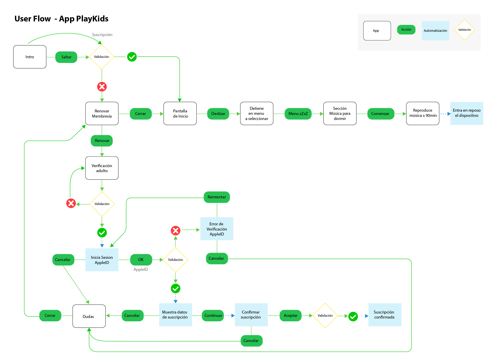
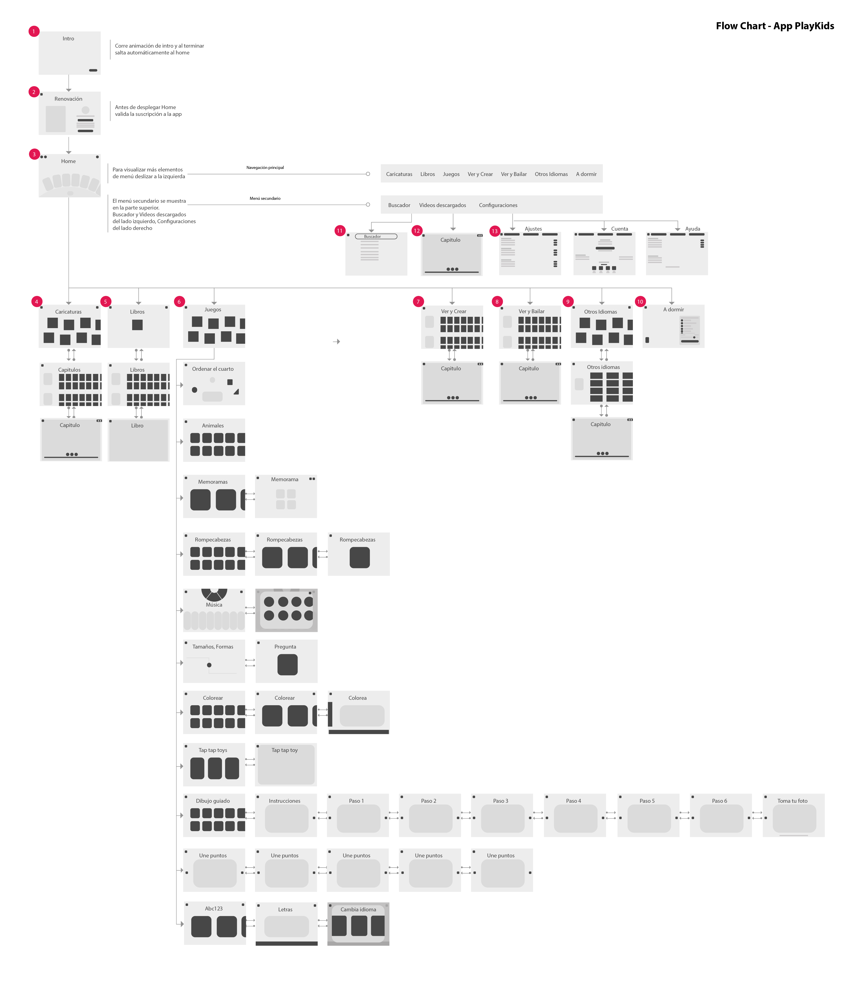

# Analizando User Flow y Flow Chart en App Play Kids

La app que he seleccionoado se llama Play Kids y es una app desarrollada principalmente para niños mayores de 4 años, se recomienda su uso bajo la supervición de los padres sin embargo es tan intuitiva que incluso niños menores de 4 años pueden utilizarla sin problema. 

### User Flow 
Para realizar el User Flow de la app Playkids he analizado el recorrido de 2 tareas una vez abierta la aplicación. Como primer tarea he seleccionado una que realizo habitualmente seleccionando el último vagón que es la sección de música para dormir. Una vez dentro de esa sección, se pueden seleccionar qué temas del playlist se van a reproducir y la duración que deseamos, normalmente ya tengo definidas esas opciones así que lo único que hago al acceder a esa sección es dar clic en el botón "Comenzar", así iniciada la reproducción se queda activa la aplicaión el tiempo que le indicamos, una vez transcurrido ese periodo, la aplicación se desactiva y el dispositivo entra en reposo.

La segunda tarea que analicé fue la de Suscripción a la app. Esta tarea inicia al terminar la animación de introducción, si la suscripción está activa inmediatamente pasa a la pantalla de inicio con el menú principal, pero si la suscripción está vencida, inmediatamente se muestra una pantalla invitando a renovarla con 1 botón bastante vistosos para iniciar el proceso de renovación, despúes de unos segundos que aparece dicho mensaje, se activa un icono de un tachesito con el que puedes dar clic e ir a la pantalla de inicio y navegar por la app. Pero si el usuario decide renovar su suscripción dando clic en "Renovar" inmediatamente solicita la verificación de un adulto, con lo que teclea una serie de 4 números que la app le indica por medio de texto. Si  la validación no es aprobada, solicita al adulto ingresar nuevamente los 4 dígitos indicados. Si la validación es aprobada, muestra una pequeña ventada de sistema solicitando que el adulto inicie sesión con su AppleID, en este punto nuevamente se hace una validación de la contraseña, si  no es correcta, se envía un mensaje de sistema indicando Error en la Verificación y presenta dos opciones, "cancelar" que envía a una pantalla preguntando si tiene dudas sobre la suscripción, o "Reintentar" que vuelve a solicitar los datos correctos del AppleID. Si la validadción es aprobada, Muestra en una ventana de sistema los datos de suscripción, el monto de pago y la duración, nuevamente se presentan dos opciones, "Cancelar" que envía a la pantalla de Dudas y "Continuar" que envía ala ventana de sistema para confirmar la suscripción. Aquí nuevamente s epresentan dos opciones, "cancelar" que lleva a la pantalla de dudas y "Aceptar" que valida la información de pago guardada en el AppleID para indicar si la suscripción se ha realizado con éxito o no.

La pantalla de dudas a la que se envía cada vez que se da cancelar en las ventanas solicitando el AppleID tienen preguntas que parecieran tratan de resolver dudas sobre la suscripción, sin embargo al dar clic sobre ellas envían nuevamente a la pantalla de Renovar membresía. Una vez ahí lo indicado para salir de esa vista sería dar clic en el icono del tachesito para ir a la página de inicio y comenzar a utilizar la aplicación.

### Flow Chart

Para el desarrollo del Flow Chart además de hacer un análisis de los elementos que contiene cada vista de la App de Play Kids, pude percibir que integra comprobaciones heurísticas de Nielsen que indican al usuario las interacciones que puede realizar a través de una navegación muy simple, ideal para la edad del público al que se dirige.

Muestra animaciones de carga de contenido, además de implementar llamadas de atención con audio, esto también se implementa al momento de descargar contenido, indicando al usuario qu uno o varios elementos están siendo descargados.

También maneja "consistencia entre el sistema y el mundo real" utilizando iconos e imágenes representativas.

EL usuario tiene la libertad de navegar dentro de la aplicación para ir accediendo entre niveles y regresar cada vez que lo necesite manejando consistencia en la ubicacioón de los botones como en la distribución de los elementos de cada sección.

La navegación es muy intuitiva y la distribución de los elementos en algunas secciones es muy similiar haciendo que los pequeños usuarios puedan desplazarse por la app de una manera muy fácil.

Dentro del menú principal y secundario, la app cuenta con accesos rápidos a la sección de videos, a los que se pueden acceder de varias maneras, ya sea de manera general, o de manefra particular seleccionando el vagón correspondiente a la animación deseada.

Visualmente la interfaz mantiene un diseño basado en ilustraciones, pero el fondo no compite con los elementos principales, haciendo que destaque la información relevante.

Así mismo previene que si los pequeños no están supervisados por sus padres no puedan acceder a las secciones restringidas solo para adultos, colocando un teclado al que solo se puede validar el ingreso digitando 4 números que la misma app indica y que solo usuarios que sepan leer pueden ingresar.

### Conclusión

Este ejercicio de análisis me ha parecido muy interesante sobre todo aplicarlo a una app dirigida a usuarios muy pequeñitos que han crecido con la tecnología y que siendo nativos digitales pueden navegar, incluso solos, sin mayor complicación, todo esto gracias a la aplicación de usabilidad.
